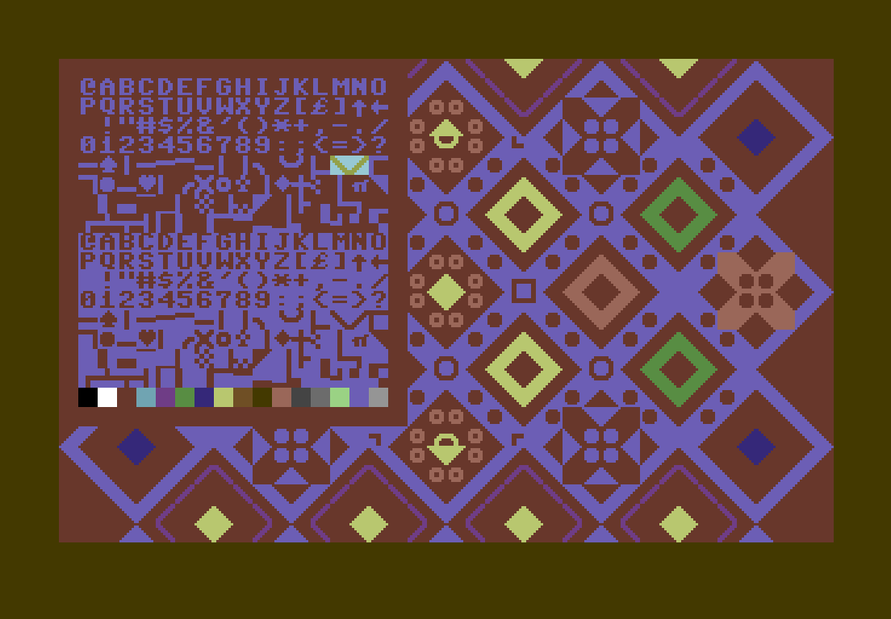

Petshop
=======

Petshop is a PETSCII editor targetting the Commodore 64. It implements
few but powerful editing features to enable quick editing using the
keyboard.

The central concept of the editor is the selection. This is a rectangle
that most editing commands apply to. The selection can be moved around
and grown with the shift and cursor keys. The selection can then be
copied, painted over, inverted, flipped, extended...see below for a full
list of commands.

The most fundamental selection command is yanking. This copies the
selected characters to an invisible buffer which can then be copied back
to the picture. When the yank buffer is copied back to the screen
(e.g. with the `f` command), if the selection is smaller than the yanked
buffer, only the portion fitting the selection is copied. If the
selection is larger than the yanked buffer, the yanked buffer is instead
repeated to fill the selection.

Another major concept is the palette. The palette can be brought up with
the return key. The palette shows all available characters and colors.
You can selection commands while the palette is enabled, but commands
that normaly affect the picture don't have an effect. When the palette is
closed with the return key again, the selection is automatically yanked.

Finally, there are two pictures. One main picture and a scratch pad. The
scratchpad is never visible, but can be swapped with the main picture by
pressing tab. Both the scratchpad and the picture are saved.

File format
-----------

       1 byte  - background color
       1 byte  - border color
       1 byte  - case (1 = lowercase, 0 = uppercase)
    1000 bytes - main picture screen data
    1000 bytes - main picture color data
    1000 bytes - scratch pad screen data
    1000 bytes - scratch pad color data

Running
-------

    $ petshop [project file]

If the project file is omitted, petshop starts with a blank slate with a
default path pointing at the current working directory ("blank.pet").
Nothing will actually be loaded, even if a file named "blank.pet"
exists.

Commands
--------

    Ctrl+Q            - quit
    Cursor keys, hjkl - Move selection
                        (shifted: change selection size)
                        (ctrl: roll selection)
    Backspace         - Reset selection size to 1x1
    y                 - Yank selection
    Space             - Open/close palette, copying the selection upon
                        exit
    Escape            - Leave palette (without copying selection)
    Tab               - Swap between main picture and scratchpad
    u                 - Undo last command
    U                 - Redo last command
    f                 - Paint yanked characters/colors over selection
                        (shifted: don't paint yanked spaces ($20))
                        In the palette, this instead has the same
                        effect as Space.
    d                 - Paint yanked characters over selection
                        (shifted: don't paint yanked spaces ($20))
    s                 - Paint yanked colors over selection
                        (shifted: don't paint yanked spaces ($20))
    I                 - Invert selected characters (EOR #$80)
    x                 - Flip selected characters horizontally
    X                 - Flip selected characters vertically
    b                 - Set background color to foreground color of
                        upper left corner of selection
    B                 - Set border color to foreground color of
                        upper left corner of selection
    i                 - Start insert mode. In insert mode, characters
                        may be inserted by typing them. The cursor can
                        still be moved by using the arrow keys. Return
                        will break the line and place the cursor on the
                        next line and in the column in which insert mode
                        was entered. You can leave insert mode by pressing
                        Escape
    t                 - Fit selection to yanked
    m                 - Toggle mouse control
    C                 - Toggle between lower/upper case
    F1                - Save project
    F2                - Load project

Mouse control
-------------

Mouse control may be toggled by pressing 'm', By default, it's enabled.

The selection may be controlled using the mouse. Holding shift, the selection
size can be changed by moving the mouse. The left, right and middle buttons
emulate keyboard presses; f, shift and y respectively.

Generate an executable
----------------------

If you want to display the image on a Commodore 64, you can concatenate
the project to the included `petstub.prg`. Example:

    petshop image.pet
    # Exit and save
    cat petstub.prg image.pet > image.prg

Todo
----

-   Export to SEQ
